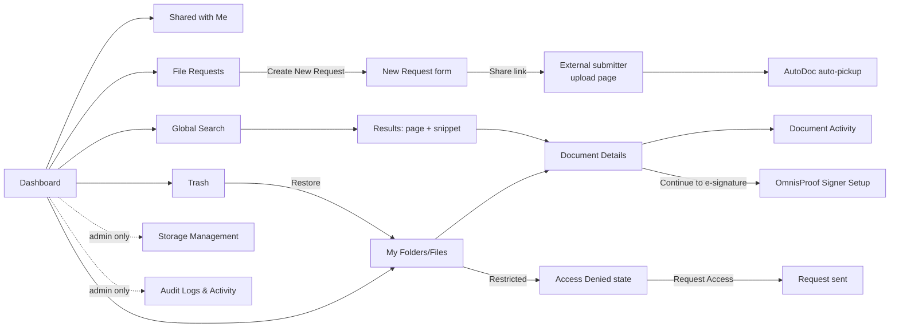

# LitBox — Master Screen Map

```mermaid
graph LR
    Dashboard --> MyFolders[My Folders/Files]
    Dashboard --> SharedWithMe[Shared with Me]
    Dashboard --> FileRequests[File Requests]
    MyFolders --> DocDetails[Document Details]
    DocDetails --> DocActivity[Document Activity]
    DocDetails -->|Continue to e-signature| OmnisProof[OmnisProof Signer Setup]
    MyFolders -->|Restricted| AccessDenied[Access Denied state]
    AccessDenied -->|Request Access| RequestSent[Request sent]
    FileRequests -->|Create New Request| NewRequest[New Request form]
    NewRequest -->|Share link| ExternalUpload[External submitter\nupload page]
    ExternalUpload --> AutoDoc[AutoDoc auto-pickup]
    Dashboard --> GlobalSearch[Global Search]
    GlobalSearch --> SearchResults[Results: page + snippet]
    SearchResults --> DocDetails
    Dashboard --> Trash
    Trash -->|Restore| MyFolders
    Dashboard -.admin only.-> StorageMgmt[Storage Management]
    Dashboard -.admin only.-> AuditTimeline[Audit Logs & Activity]
```
