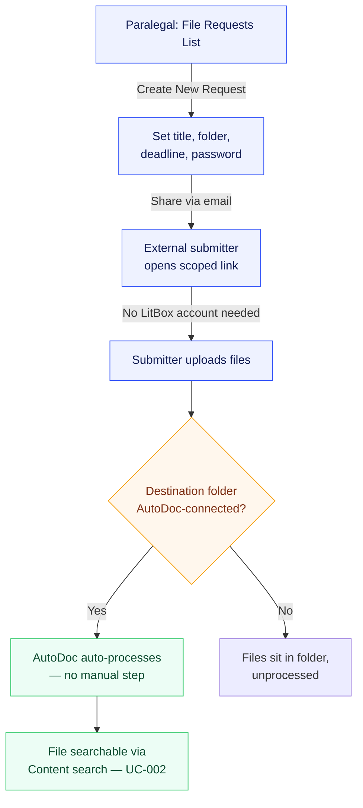

# UC-001: File Request → AutoDoc Auto-Pickup

```mermaid
graph TD
    A[Paralegal: File Requests List] -->|Create New Request| B[Set title, folder,\ndeadline, password]
    B -->|Share via email| C[External submitter\nopens scoped link]
    C -->|No LitBox account needed| D[Submitter uploads files]
    D --> E{Destination folder\nAutoDoc-connected?}
    E -->|Yes| F[AutoDoc auto-processes\n— no manual step]
    E -->|No| G[Files sit in folder,\nunprocessed]
    F --> H[File searchable via\nContent search — UC-002]

    classDef userStep fill:#eef2ff,stroke:#3353f8,color:#111c53
    classDef systemStep fill:#ecfdf5,stroke:#22c55e,color:#0b4a2e
    classDef decision fill:#fff7ed,stroke:#f59e0b,color:#7c2d12
    class A,B,C,D userStep
    class F,H systemStep
    class E decision
```
