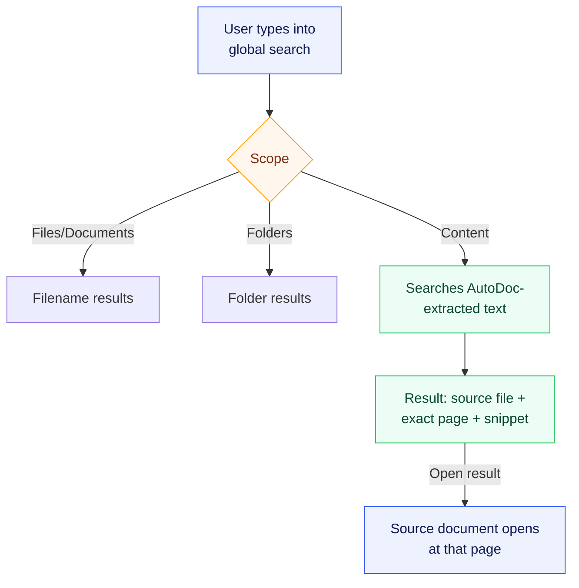

# UC-002: Content Search Across a Matter

```mermaid
graph TD
    A[User types into\nglobal search] --> B{Scope}
    B -->|Files/Documents| C[Filename results]
    B -->|Folders| D[Folder results]
    B -->|Content| E[Searches AutoDoc-\nextracted text]
    E --> F[Result: source file +\nexact page + snippet]
    F -->|Open result| G[Source document opens\nat that page]

    classDef userStep fill:#eef2ff,stroke:#3353f8,color:#111c53
    classDef systemStep fill:#ecfdf5,stroke:#22c55e,color:#0b4a2e
    classDef decision fill:#fff7ed,stroke:#f59e0b,color:#7c2d12
    class A,G userStep
    class E,F systemStep
    class B decision
```
