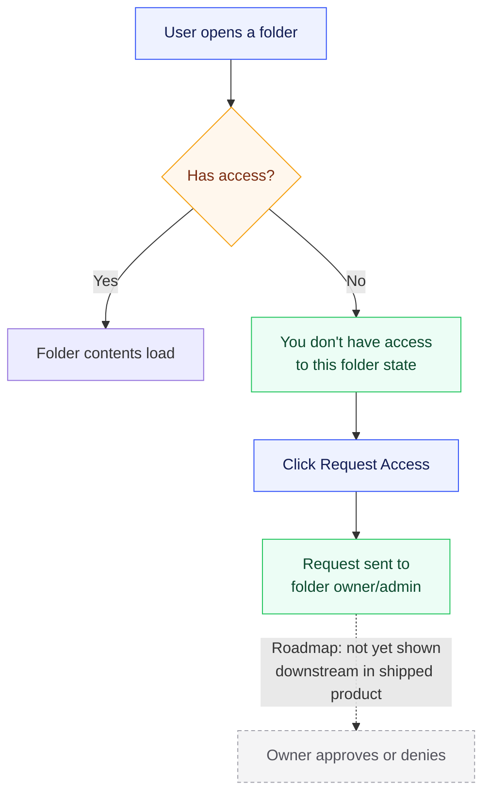

# UC-003: Permission Denied → Request Access

```mermaid
graph TD
    A[User opens a folder] --> B{Has access?}
    B -->|Yes| C[Folder contents load]
    B -->|No| D["You don't have access\nto this folder" state]
    D --> E[Click Request Access]
    E --> F[Request sent to\nfolder owner/admin]
    F -.->|Roadmap: not yet shown\ndownstream in shipped product| G[Owner approves or denies]

    classDef userStep fill:#eef2ff,stroke:#3353f8,color:#111c53
    classDef systemStep fill:#ecfdf5,stroke:#22c55e,color:#0b4a2e
    classDef decision fill:#fff7ed,stroke:#f59e0b,color:#7c2d12
    classDef roadmap fill:#f4f4f5,stroke:#a1a1aa,color:#52525b,stroke-dasharray: 4 3
    class A,E userStep
    class D,F systemStep
    class B decision
    class G roadmap
```

**Note**: node G is dashed/roadmap — the case study's own honesty framing (Section 03) means
this isn't drawn as a confirmed shipped step.
