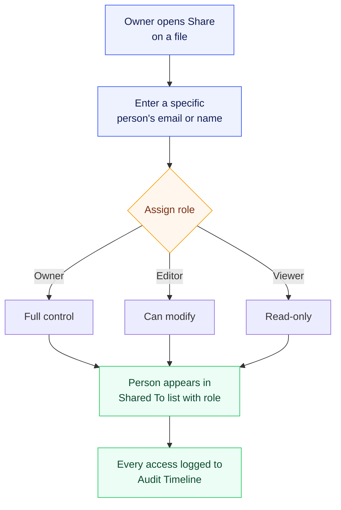

# UC-004: Sharing a File With Per-Person Roles

```mermaid
graph TD
    A[Owner opens Share\non a file] --> B[Enter a specific\nperson's email or name]
    B --> C{Assign role}
    C -->|Owner| D[Full control]
    C -->|Editor| E[Can modify]
    C -->|Viewer| F[Read-only]
    D --> G[Person appears in\nShared To list with role]
    E --> G
    F --> G
    G --> H[Every access logged to\nAudit Timeline]

    classDef userStep fill:#eef2ff,stroke:#3353f8,color:#111c53
    classDef systemStep fill:#ecfdf5,stroke:#22c55e,color:#0b4a2e
    classDef decision fill:#fff7ed,stroke:#f59e0b,color:#7c2d12
    class A,B userStep
    class G,H systemStep
    class C decision
```
