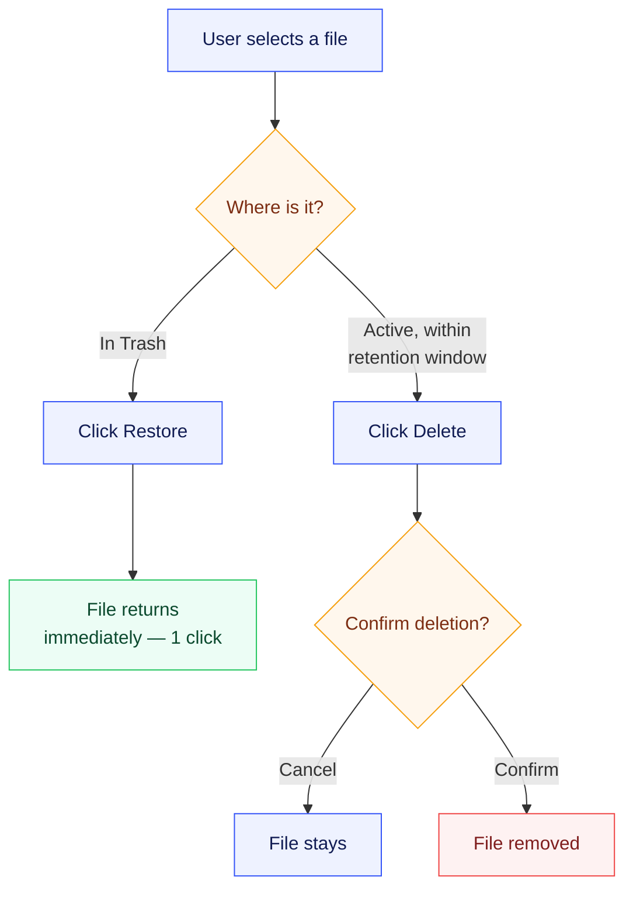

# UC-006: Restore vs. Delete — Two Different Frictions

**Design intent, drawn on purpose**: Restore (left branch) is one click, no gate. Delete
(right branch) has a deliberate confirm gate — the case study's stated reason is "nothing
sensitive disappears silently."
